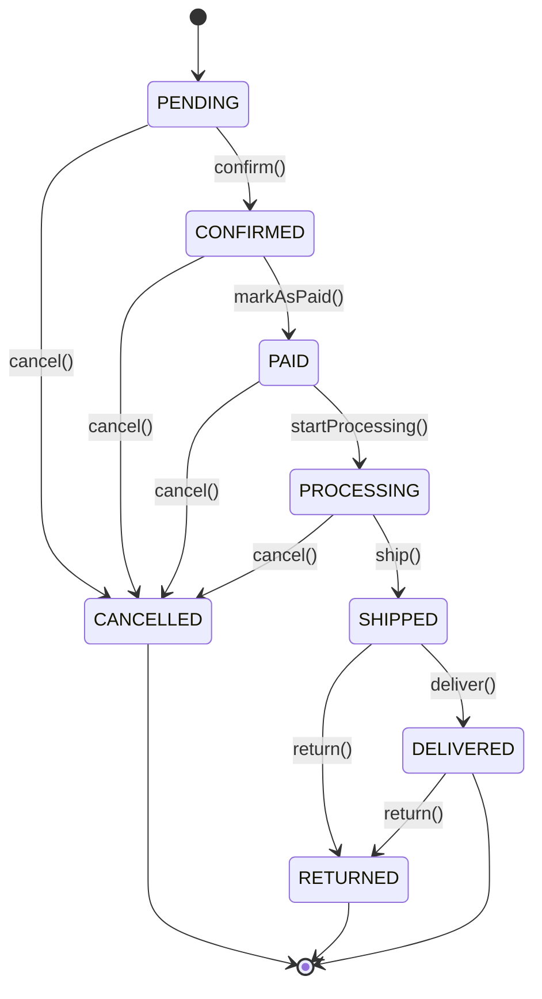

# Aggregate Design

## Principles

1. **Consistency Boundary:** Aggregates enforce business invariants
2. **Transactional Boundary:** Changes within aggregate are atomic
3. **Small Aggregates:** Prefer smaller aggregates for better performance
4. **Reference by ID:** Aggregates reference each other by ID, not object reference
5. **Single Responsibility:** Each aggregate has one clear purpose

---

## User Aggregate

**Aggregate Root:** User

**Entities:**
- User (root)

**Value Objects:**
- Email
- Password (hashed)
- PhoneNumber
- Address

**Invariants:**
- Email must be unique
- Password must meet complexity requirements (min 8 characters)
- Seller must have shop details
- Phone number must be valid format

**Lifecycle:**
1. User registers → UserRegistered event
2. User logs in → UserLoggedIn event
3. User updates profile → UserProfileUpdated event
4. User changes role → UserRoleChanged event
5. Password changed → PasswordChanged event

**Business Rules:**
- Cannot register with existing email
- Password must be hashed before storage
- Sellers require additional validation
- Admin role can only be assigned by existing admin

---

## Product Aggregate

**Aggregate Root:** Product

**Entities:**
- Product (root)

**Value Objects:**
- ProductId
- SKU
- Money (price, actualPrice, sellingPrice)
- ProductImage
- ProductDetails
- Quantity (stock)

**Invariants:**
- Selling price must be ≤ actual price
- Product must have at least one image
- Out of stock products cannot be purchased
- SKU must be unique per seller
- Stock quantity cannot be negative

**Lifecycle:**
1. Product created → ProductCreated event
2. Price updated → PriceChanged event
3. Inventory depleted → ProductOutOfStock event
4. Inventory replenished → ProductRestocked event
5. Product updated → ProductUpdated event
6. Product deleted → ProductDeleted event

**Business Rules:**
- Only seller can modify their products
- Price changes trigger PriceChanged event
- Stock updates trigger inventory events
- Deleted products cannot be restored

**State Transitions:**
```
DRAFT → ACTIVE → OUT_OF_STOCK → RESTOCKED → ACTIVE
  ↓       ↓
DELETED  DELETED
```

---

## Order Aggregate

**Aggregate Root:** Order

**Entities:**
- Order (root)
- OrderItem (child)

**Value Objects:**
- OrderId
- OrderNumber
- Money (total, subtotal)
- ShippingAddress
- OrderStatus
- TrackingNumber
- DeliveryDate

**Invariants:**
- Order must have at least one item
- Order total must match sum of items
- Cannot cancel shipped orders
- Cannot modify confirmed orders
- Shipping address is required
- Order items must reference valid products

**State Machine:**


**Lifecycle:**
1. Order placed → OrderPlaced event
2. Order confirmed → OrderConfirmed event
3. Payment received → OrderPaid event
4. Order processing → OrderProcessing event (internal)
5. Order shipped → OrderShipped event
6. Order delivered → OrderDelivered event
7. Order cancelled → OrderCancelled event
8. Return requested → ReturnRequested event
9. Order returned → OrderReturned event

**Business Rules:**
- Order can only be cancelled before shipping
- Delivered orders can be returned within 7 days
- Order total includes items + tax + shipping
- Cannot add items after confirmation
- Each order item tracks product snapshot (price at time of order)

**Allowed Transitions:**
- PENDING → CONFIRMED, CANCELLED
- CONFIRMED → PAID, CANCELLED
- PAID → PROCESSING, CANCELLED
- PROCESSING → SHIPPED
- SHIPPED → DELIVERED, RETURNED
- DELIVERED → RETURNED (within return window)

---

## Cart Aggregate

**Aggregate Root:** Cart

**Entities:**
- Cart (root)
- CartItem (child)

**Value Objects:**
- CartId
- Money (subtotal, total)
- Quantity
- Discount

**Invariants:**
- Cart items must reference valid products
- Quantity must be positive
- Maximum 50 items per cart
- Cart total must match sum of items
- Cannot add out-of-stock products

**Lifecycle:**
1. Item added → ItemAddedToCart event
2. Quantity updated → CartItemQuantityUpdated event
3. Item removed → ItemRemovedFromCart event
4. Cart cleared → CartCleared event
5. Cart checked out → (transforms to Order)

**Business Rules:**
- Cart is user-specific
- Cart items validate against current product price
- Cart can be abandoned (future: trigger notification)
- Cart persists across sessions
- Duplicate products merge quantities

**Operations:**
- `addItem(productId, quantity)` - Add or update item
- `removeItem(productId)` - Remove specific item
- `updateQuantity(productId, quantity)` - Change item quantity
- `clear()` - Remove all items
- `calculateTotal()` - Compute cart total

---

## Payment Aggregate

**Aggregate Root:** Payment

**Entities:**
- Payment (root)
- Transaction (child)

**Value Objects:**
- PaymentId
- TransactionId
- Money (amount)
- PaymentStatus
- StripeCustomerId
- PaymentMethod

**Invariants:**
- Payment amount must match order total
- Cannot refund more than paid amount
- Payment must be authorized before capture
- One payment per order
- Transaction history is immutable

**State Machine:**
```
INITIATED → AUTHORIZED → CAPTURED → COMPLETED
    ↓           ↓            ↓
  FAILED     FAILED      REFUNDED
```

**Lifecycle:**
1. Payment initiated → PaymentInitiated event
2. Payment authorized → PaymentAuthorized event
3. Payment captured → PaymentCaptured event
4. Payment completed → PaymentCompleted event (internal)
5. Payment failed → PaymentFailed event
6. Refund initiated → RefundInitiated event
7. Refund processed → PaymentRefunded event

**Business Rules:**
- Authorization reserves funds for 7 days
- Capture must happen within authorization window
- Partial refunds allowed
- Failed payments can be retried
- Payment methods validated before processing

**Allowed Transitions:**
- INITIATED → AUTHORIZED, FAILED
- AUTHORIZED → CAPTURED, FAILED
- CAPTURED → COMPLETED, REFUNDED
- FAILED → (terminal state)
- REFUNDED → (terminal state)

---

## Wishlist Aggregate

**Aggregate Root:** Wishlist

**Entities:**
- Wishlist (root)

**Value Objects:**
- WishlistId
- ProductId (references)

**Invariants:**
- Wishlist is user-specific
- No duplicate products
- Products must exist
- Maximum 100 items

**Lifecycle:**
1. Item added → ItemAddedToWishlist event
2. Item removed → ItemRemovedFromWishlist event
3. Item moved to cart → ItemMovedToCart event

**Business Rules:**
- One wishlist per user
- Can add out-of-stock products
- Wishlist persists indefinitely
- Products can be moved to cart

---

## Notification Aggregate

**Aggregate Root:** Notification

**Entities:**
- Notification (root)

**Value Objects:**
- NotificationId
- NotificationType
- Channel
- Content

**Invariants:**
- Notification must have recipient
- Content must not be empty
- Channel must be valid
- Sent notifications are immutable

**Lifecycle:**
1. Notification created → NotificationCreated event (internal)
2. Notification sent → NotificationSent event
3. Notification failed → NotificationFailed event
4. Notification read → NotificationRead event

**Business Rules:**
- Failed notifications can be retried
- Read status tracked per user
- Notifications expire after 30 days
- User preferences control delivery

---

## Aggregate Relationships

### Reference Patterns

**By ID (Preferred):**
```typescript
class Order {
  userId: string;  // Reference to User aggregate
  items: OrderItem[];  // Contains productId references
}
```

**Not by Object:**
```typescript
// ❌ AVOID
class Order {
  user: User;  // Direct object reference
  items: Product[];  // Direct object references
}
```

### Cross-Aggregate Consistency

**Eventual Consistency:**
- Order → Product (inventory update)
- Order → Notification (status updates)
- Payment → Order (payment confirmation)

**Strong Consistency:**
- Within Order aggregate (items, total)
- Within Cart aggregate (items, total)
- Within Payment aggregate (transactions)

---

## Aggregate Size Guidelines

### Small Aggregates (Preferred)
- User: Single entity
- Product: Single entity
- Wishlist: Single entity + item list

### Medium Aggregates
- Cart: Root + items (max 50)
- Notification: Root + metadata

### Larger Aggregates (Justified)
- Order: Root + items + status history
- Payment: Root + transactions + refunds

**Rule of Thumb:** If aggregate has >100 child entities, consider splitting

---

## Transaction Boundaries

### Single Aggregate Transaction
```typescript
// ✅ GOOD: Single aggregate
async placeOrder(cart: Cart): Promise<Order> {
  const order = Order.fromCart(cart);
  await orderRepository.save(order);
  return order;
}
```

### Multi-Aggregate Transaction (Avoid)
```typescript
// ❌ AVOID: Multiple aggregates in one transaction
async checkout(cartId, paymentInfo) {
  const cart = await cartRepo.findById(cartId);
  const order = Order.fromCart(cart);
  const payment = Payment.create(order.total);
  
  // Don't do this in one transaction
  await orderRepo.save(order);
  await paymentRepo.save(payment);
  await cartRepo.delete(cartId);
}
```

### Correct Approach (Events)
```typescript
// ✅ GOOD: Use events for cross-aggregate coordination
async placeOrder(cart: Cart): Promise<Order> {
  const order = Order.fromCart(cart);
  await orderRepository.save(order);
  
  // Emit event for other aggregates
  await eventBus.publish(new OrderPlaced(order.id));
  
  return order;
}
```

---

## Aggregate Design Checklist

- [ ] Aggregate root clearly identified
- [ ] Invariants documented
- [ ] State transitions defined
- [ ] Lifecycle events identified
- [ ] Business rules captured
- [ ] Size is reasonable (<100 entities)
- [ ] References other aggregates by ID
- [ ] Transactional boundary is clear
- [ ] Eventual consistency handled via events

---

**Last Updated:** 2026-01-04  
**Maintained By:** Development Team  
**Review Frequency:** Per sprint or when domain changes
